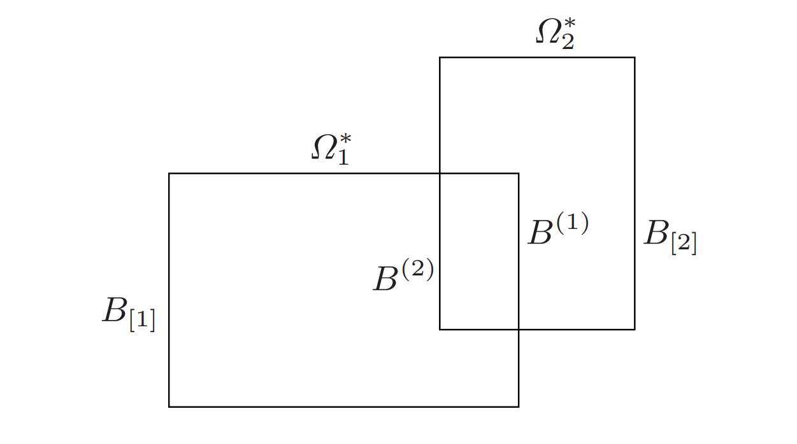

# 2.1.1 Elliptic Equation
We consider the following self adjoint and coercive elliptic equation:

$$
\left\{
\begin{array}{rl}
Lu\equiv -\nabla\cdot(a(x)\nabla u) + c(x)u= f,& \mathrm{in}\ \Omega,\\
u=g_D,& \mathrm{on}\ \mathcal{B}_D\\
\mathbf{n}\cdot(a\nabla u) + \gamma u = g_N,& \mathrm{on}\ \mathcal{B}_N\\
\end{array}
\right. \tag{2.1}
$$

^9590c2

on a domain $\Omega\subset \mathbb{R}^d$ for $d=2,3$, with unit exterior normal $\mathbf{n}(x)$ at $x\in\partial \Omega$, Dirichlet boundayr $\mathcal{B}_D\subset\partial\Omega$, and natural (Neumann or Robin) boundary $\mathcal{B}_N\subset\partial\Omega$ where $\overline{\mathcal{B}}_D\cap\overline{\mathcal{B}}_N=\partial\Omga$ and $\mathcal{B}_D\cap\mathcal{B}_N=\emptyset$. We shall assume that the diffusion coefficient $a(x)$ is piecewise smooth and for $0<a_0\leq a_1$ satisfies:

$$a_0\lvert \boldsymbol{\xi}\rvert^2\leq\boldsymbol{\xi}^Ta(x)\boldsymbol{\xi}\leq a_1\lvert\boldsymbol{\xi}\rvert^2,\qquad \forall x\in\Omega,\ \boldsymbol{\xi}\in\mathbb{R}^d.$$

To ensure the coercivitry of [[2.1 Background#^9590c2|(2.1)]]. we shall assyne that $c(x)\geq 0$ and $\gamma(x)\geq 0$. In most applications, we shall assume $\mathcal{B}_D=\partial\Omega$ and $\mathcal{B}_N=\emptyset$.

**<big>Remark 2.1</big>**: When $\mathcal{B}_D=\emptyset$, $\gamma(x)\equiv 0$ and $c(x)\equiv 0$, functions $f(x)$ and $g_N(x)$ will be required to satisfy compatibility conditions for solvability of [[2.1 Background#^9590c2|(2.1)]]:
$$\int_\Omega f(x)\mathrm{d}x + \int_{\partial\Omega} g_N(x)\mathrm{d}S_x = 0.$$
In this case, the general solution $u(\cdot)$ to the Neumann boundary value problem will not be unique, and will satisfy $u(x)\equiv u_*(x) + \alpha$ where $u_*(x)$ is any particular non-homogeneous solution and $\alpha$ is a constant.

# 2.1.4 Multisubdomain Decomposition
We employ the following notation for multidomain decompositions, see [[2.1 Background#^7af1b6|Fig 2.1]]

 ^7af1b6

<a name = "fig:1.3">Fig 2.1 Multidomain overlapping and non-overlapping decompositions</a>

**<big>Definition 2.4</big>**: A collection of open subregions $\Omega_i\subset\Omega$ for $1\leq i\leq p$ will be referred to as a nonoverlapping decomposition of $\Omega$ if the following holds:
$$\left\{
\begin{array}{ll}
\cup_{l=1}^p \overline{\Omega}_i = \overline{\Omega},&\\
\Omega_i\cap\Omega_j=\emptyset,& \mathrm{if}\ i\neq j.
\end{array}
\right.$$
Boundaries of the subdomains will be denoted $B_i\equiv \partial\Omega_i$ and their interior and exterior segments by $B^{(i)}\equiv \partial\Omega_i\cap\Omega$ and $B_{[i]}\equiv\partial\Omega_i\cap\partial\Omega$, respectively. We denote common interfaces by $B_{i,j}\equiv B_i\cap B_j$ and $B\equiv \cup_i B^{(i)}$.

When the subdomains $\Omega_i$ are shape regular, we let $h_0$ denote its diameter. For additional notation on non-overlapping subdomains, see [[3.1 Background|Chapter 3]].

**<big>Definition 2.5</big>**: A collection of open subregions $\Omega_i^*\subset \Omega$ for $1\leq i\leq p$ will be referred to as an overlapping decomposition of $\Omega$ if the following holds:
$$\cap_{l=1}^p\Omega_i^*=\Omega.$$
If $\{\Omega_l\}_{l=1}^p$ forms a non-overlapping decomposition of $\Omega$ of diameter $h_0$ and each $\Omega_i\subset\Omega_i^*$, then $\{\Omega_l^*\}_{l=1}^p$ will be said to form an overlapping decomposition of $\Omega$ obtained by externsion of $\{\Omega_l\}_{l=1}^p$. Most commonly:

$$\Omega_i^* \equiv\Omega_i^{\beta\ h0}\equiv\left\{x\in\Omega:\mathrm{dist}(x,\Omega_i)<\beta h_0\right\} \tag{2.8}$$

where $0<\beta<1$ is called the overlap factor. Boundaryies will be denoted $\partial \Omega_i^*$ and with abuse of notation, $B^{(i)}\equiv \partial\Omega_i^*\cap\Omega$ and $B_{[i]}\equiv\partial\Omega_i^*\cap\partial\Omega$, respectively.

# 2.1.5 Restriction and Extension Maps 
A restriction map will restrict a vector of nodal values to a subvector corresponding to indices in some index set $\mathcal{S}$. An extension map will extend a subvector of nodal values in $\mathcal{S}$ to a full vector, whose entries will be zero outside $\mathcal{S}$. Formally, given any subregion $\mathcal{S}\subset (\Omega\cup\mathcal{B}_N)$, order the nodes of $\mathcal{T}_h(\Omega)$ in $\mathcal{S}$ in some local ordering. Let $n\equiv(n_I + n_{\mathcal{B}_N})$ denote the total number of unknowns, and $n_{\mathcal{S}}$ the number of nodes of $\mathcal{T}_h(\Omega)$ in $\mathcal{S}$. We shall associate an index function $\mathrm{index}(\mathcal{S}, i)$ to denote the global index of the i'th local node in $\mathcal{S}$ for $1\leq i\leq n_{\mathcal{S}}$. We then define an $n_{\mathcal{S}} \times n$ restriction matrix $R_{\mathcal{S}}$ which will map a vector in $\mathbb{R}^n$ of nodal values on the grid $\mathcal{T}_h(\Omega)$ into a subvector in $\mathbb{R}^{n_{\mathcal{S}}}$ of nodal values associated with the nodes in $\mathcal{S}$ in the local ordering:

$$
(R_{\mathcal{S}})_{ij}=\left\{\begin{array}{cc}
1& \mathrm{if}\ \mathrm{index}(\mathcal{S}, i) = j\\
0& \mathrm{if}\ \mathrm{index}(\mathcal{S}, i) \neq j.\\
\end{array}\right.$$
**<big>Remark</big>**: The restriction operator restricts a global vector to local vector about $\mathcal{S}$. The entries not containing in $\mathcal{S}$ are omitted, while those belongs to $\mathcal{S}$ are reordered with local order.

The transpose $R_{\mathcal{S}}^T$ of restriction matrix $R_{\mathcal{S}}$ is referred to as an extension matrix. It will be an $n\times n_{\mathcal{S}}$ matrix which extends a vector in $\mathbb{R}^{n_{\mathcal{S}}}$ to a vector in $\mathbb{R}^n$ with zero entries corresponding to indices not in $\mathcal{S}$.

**<big>Remark</big>**: The extension operator extends a local vector about $\mathcal{S}$ to a global vector. The entries not containing in $\mathcal{S}$ are left zero, while those belongs to $\mathcal{S}$ are reordered with global order.

**<big>Remark 2.7</big>**: Given the global stiffness matrix $A_h$ of size n, its submatrix $A_{\mathcal{S}\mathcal{S}}$ of size $n_{\mathcal{S}}$ corresponding to the nodes in $\mathcal{S}$ may be expressed formally as:
$$A_{\mathcal{S}\mathcal{S}} = R_{\mathcal{S}}A_hR_{\mathcal{S}}^T.$$

**<big>Remark 2.8</big>**: Typical choises of $\mathcal{S}$ in Schwarz algorithms will be indices of nodes in $\Omega_i^*\cup(\mathcal{B}_N\cap\partial\Omega_i^*)$. 

# 2.1.7 Coarse Spaces
The convergence rate of one-level domain decomposition algorithms (namely, algorithms involving only subdomains problems) will typically deteriorate as the number $p$ of subdomains increases.

The preceding limitation in the rate of convergence of one-level domain decomposition iterative algorithms can be handled if a mechanism is included for the global transfer of information across the subdomains.